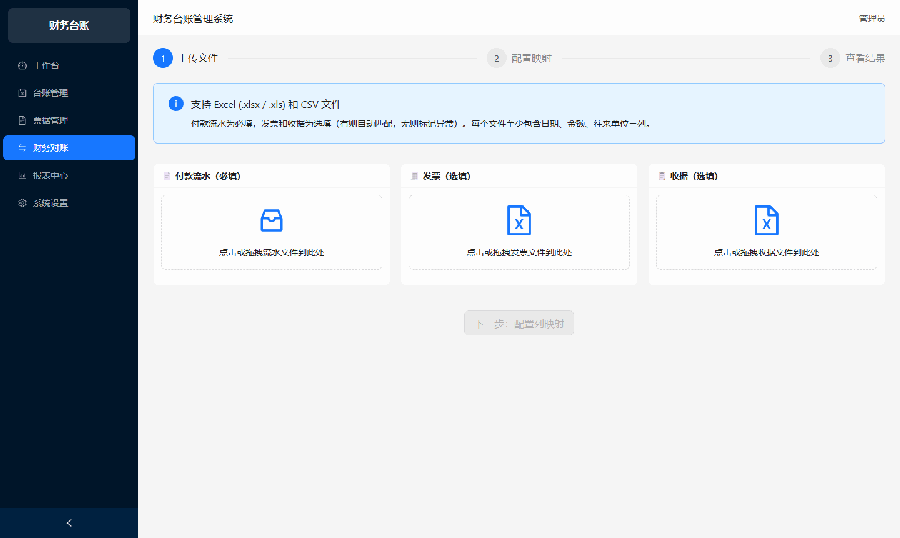
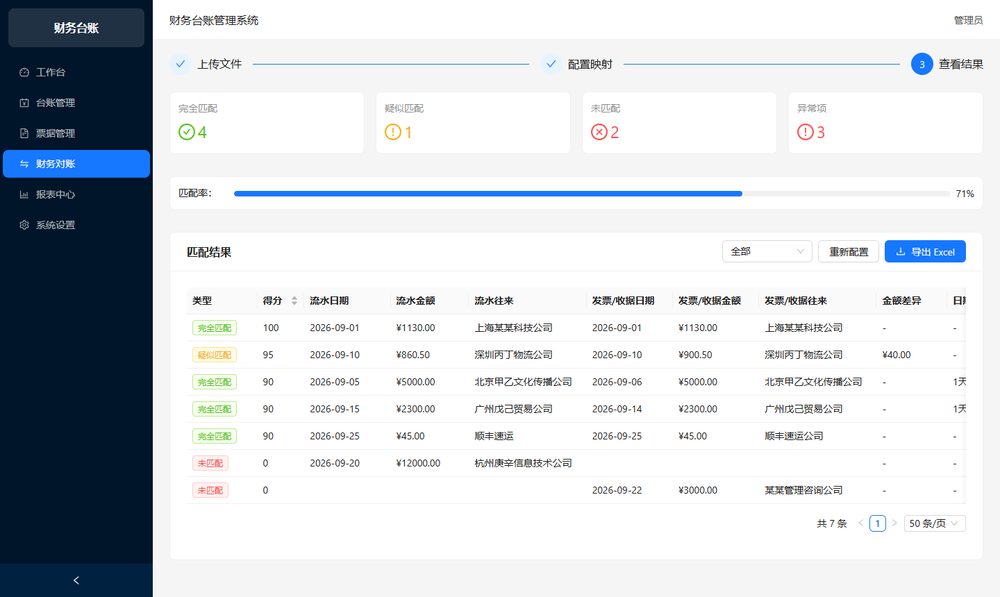
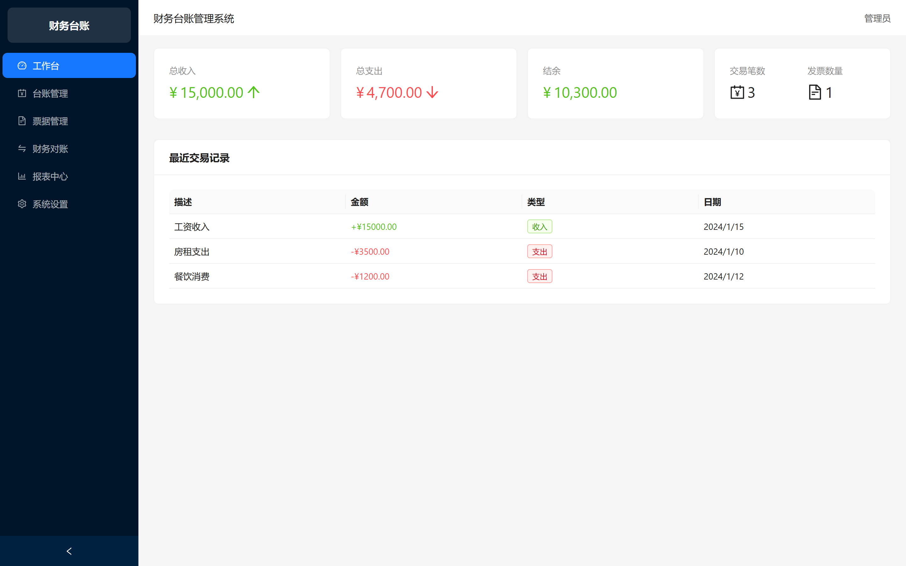
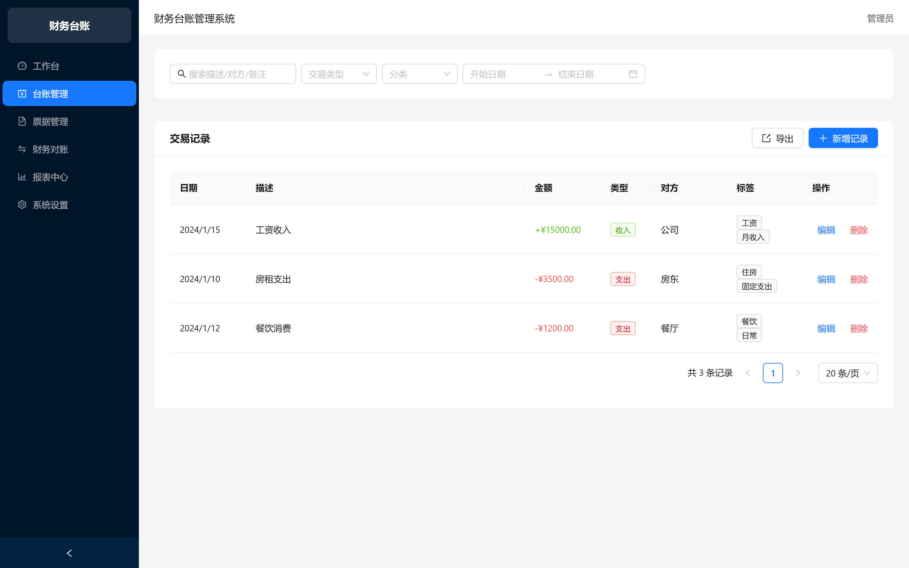
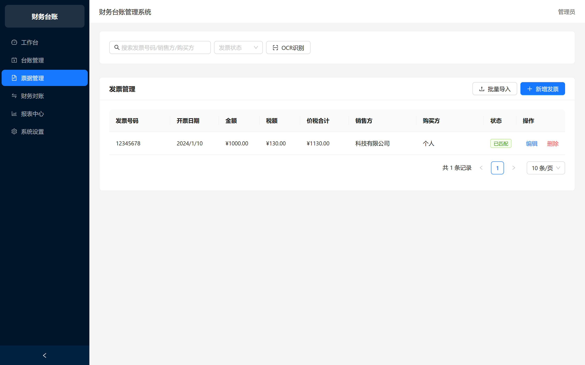
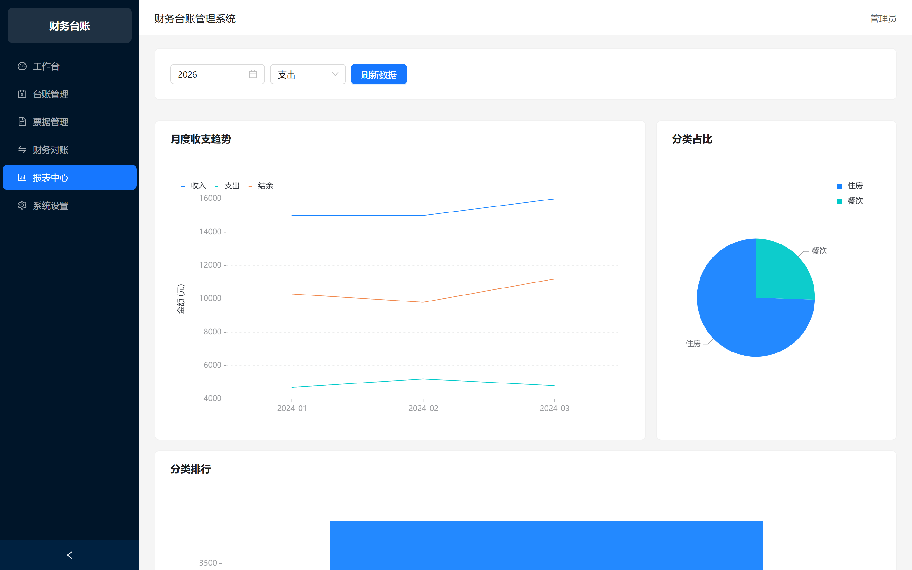
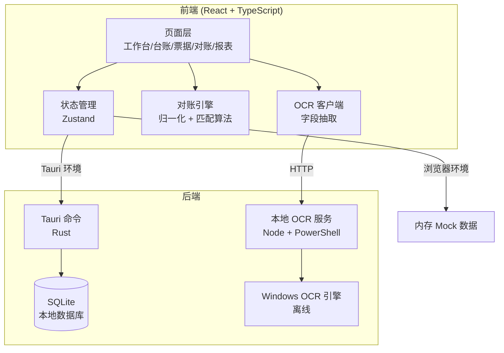
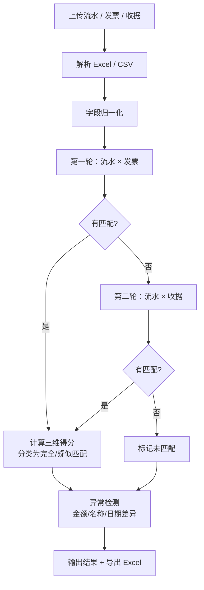

# 财务台账管理系统

> 面向小型企业 / 工作室的本地化财务台账管理工具 —— 台账记账、发票 OCR 识别、自动对账、报表分析全流程覆盖。

**核心特点：数据不出本机 · OCR 零 API 成本 · 开箱即用**

🔗 **在线 Demo**：<https://finance-ledger-tau.vercel.app>

> ⚠️ 受 `*.vercel.app` 域名 DNS 污染影响，国内网络访问该链接需要代理。
> 如需国内直连体验，可将自定义域名绑定到 Vercel（服务器 IP 在国内可直连，实测 74ms）。

---

## 📖 目录

- [功能概览](#-功能概览)
- [界面预览](#-界面预览)
- [技术亮点](#-技术亮点)
- [技术栈](#-技术栈)
- [快速开始](#-快速开始)
- [项目结构](#-项目结构)
- [核心实现](#-核心实现)
- [部署](#-部署)

---

## 🖼 界面预览

### 财务对账全流程演示

上传流水 / 发票 / 收据 → 自动识别列映射 → 三维匹配 → 结果分类与异常标记：



> 演示数据在 [`docs/demo-data/`](docs/demo-data/)，可自行下载后按上面流程试跑。
> 数据刻意设计为覆盖全部场景：4 笔可匹配（含金额差额、名称变体、日期偏移）、
> 1 笔有流水无发票、1 笔有发票无流水、1 笔用收据匹配。

### 对账结果页

完全匹配 4 ｜ 疑似匹配 1 ｜ 未匹配 2 ｜ 异常 3 ｜ 匹配率 71%



### 工作台



### 台账管理



### 票据管理



### 报表中心



---

## ✨ 功能概览

### 📊 台账管理
- 多账簿支持（日常经营 / 项目专项 / 备用金，互不干扰）
- 三级结构：**账簿 → 科目 → 交易**，每个账簿独立科目体系
- 交易记录多维度筛选：日期范围、分类、交易类型、关键词全文搜索
- 支持标签、往来单位、备注等扩展字段

### 🧾 票据管理与 OCR 识别
- 集成 **Windows 内置 OCR 引擎**（`Windows.Media.Ocr`），**完全离线、零 API 成本**
- 单张发票识别耗时 **约 47ms**，中文识别准确率高
- 自动抽取 7 个关键字段：发票号码、开票日期、金额、税额、价税合计、销售方、购买方
- 识别结果自动回填表单，**人工核对后保存**（机器预填 + 人工确认的设计原则）
- OCR 原文与发票记录绑定存储，支持审计回溯

### 🔄 财务对账（核心功能）
读取付款流水、发票、收据三类文件，自动匹配并输出对账报告：

| 能力 | 说明 |
|------|------|
| **文件读取** | 支持 Excel（`.xlsx` / `.xls`）与 CSV，自动猜测列映射，降低使用门槛 |
| **字段归一化** | 日期、金额、往来名称三个关键字段统一口径（详见[核心实现](#-核心实现)） |
| **三维匹配** | 金额容差 × 日期容差 × 往来名称相似度（编辑距离算法）加权打分 |
| **三分类结果** | 完全匹配（≥85 分）/ 疑似匹配（40~84 分）/ 未匹配（<40 分） |
| **异常标记** | 7 类异常自动识别并写明原因（见下表） |
| **报表导出** | 一键导出 `财务对账结果.xlsx`，含 6 个 Sheet |

**异常检测覆盖的 7 种情况：**

| 异常类型 | 严重程度 | 触发条件 |
|----------|---------|---------|
| 有流水无发票 | 错误 | 付款记录找不到对应的发票或收据 |
| 有发票无流水 | 错误 | 发票记录找不到对应的付款 |
| 金额不一致 | 错误 | 匹配成功但金额差额超出容差 |
| 往来单位不一致 | 警告 | 名称相似度低于阈值 |
| 日期差异过大 | 警告 | 日期相差超出配置天数 |
| 金额为零 | 警告 | 流水行金额解析为 0 或空 |
| 疑似重复 | 警告 | 预留扩展 |

### 📈 报表中心
- 月度收支趋势线图（收入 / 支出 / 结余三条序列）
- 分类占比饼图、分类排行条形图
- 支持按年份、收支类型筛选，图表实时联动
- 工作台关键指标卡片：总收入、总支出、结余、交易笔数、发票数量

### 🔒 安全与合规
- 数据本地存储（SQLite），不开放网络端口
- 审计日志表记录所有关键操作
- 敏感字段可加密存储
- 数据库为单文件，拷贝即完成备份

---

## 🎯 技术亮点

### 1. OCR 方案选型：为什么用 Windows 内置引擎而不是 tesseract.js

| 对比项 | Windows 内置 OCR | tesseract.js |
|--------|-----------------|--------------|
| 中文识别准确率 | 高（实测 6/6 字段正确） | 中等（中文发票偏弱） |
| 单张耗时 | **47ms** | 秒级 |
| 依赖 | 系统自带，零安装 | 需下载约 15MB 模型 |
| 数据安全 | **完全离线** | 首次需联网下载模型 |

财务场景下「数据不出本机」的优先级高于跨平台便利性，因此选择前者。同时不依赖任何云端 API，边际成本为零。

### 2. 对账匹配算法：三维加权评分

```
综合得分 = 金额得分（40 分）+ 日期得分（30 分）+ 往来名称得分（30 分）

金额得分：差额 ≤ 容差 → 满分；否则按差额比例衰减
日期得分：同日 → 满分；容差内 → 20 分；超出 → 衰减
名称得分：相似度 ≥ 90% → 满分；≥ 阈值 → 20 分；否则按相似度折算
```

**为什么用编辑距离而不是精确匹配？** 现实中同一家公司在不同系统里的名称经常不一致：

```
流水里写：上海某某科技有限公司
发票里写：某某科技公司
```

配合名称归一化（剥离括号内容、统一「有限公司 / 股份公司 / 有限责任公司」后缀、去除「中国」前缀），再叠加编辑距离相似度，把匹配率从精确匹配的水平大幅提升。

### 3. 双模式 API：一套代码同时支持桌面版与 Web 版

`src/api/index.ts` 运行时检测 `window.__TAURI__`：

- 存在 → 调用 Rust 命令，数据落 SQLite
- 不存在 → 自动回退到内存 mock 数据，浏览器可独立运行

好处是开发阶段无需安装 Rust 工具链即可调试全部界面，部署时零改动切换到真实后端。

---

## 🛠️ 技术栈

| 层级 | 技术选型 | 说明 |
|------|---------|------|
| 桌面框架 | **Tauri 1.5 + Rust** | 打包体积 5~10MB，远小于 Electron 的 150MB+ |
| 前端框架 | **React 18 + TypeScript** | strict 模式，零 `any` 逃逸 |
| UI 组件库 | **Ant Design 5** | 企业级组件，表格/表单开箱即用 |
| 数据可视化 | **@ant-design/charts (G2 v5)** | 折线 / 饼图 / 条形图 |
| 状态管理 | **Zustand** | 比 Redux 代码量少约 60% |
| 本地数据库 | **SQLite (rusqlite)** | 零配置、事务安全、单文件备份 |
| Excel 读写 | **SheetJS (xlsx)** | 浏览器内解析与导出对账报表 |
| 构建工具 | **Vite 5 + pnpm** | 依赖预构建冷启动 < 2s |
| OCR | **Windows.Media.Ocr** | 离线、免密、免网络 |

---

## 🚀 快速开始

### 环境要求

- **Node.js** >= 18.0.0
- **pnpm** >= 8.0.0
- **Rust** >= 1.70.0（仅桌面版需要，Web 版可跳过）

### 方式一：Web 版（无需 Rust，推荐先跑这个）

```bash
# 安装依赖
pnpm install

# 启动开发服务器（热更新）
pnpm dev:web

# 浏览器访问 http://localhost:3000
```

生产构建与预览：

```bash
pnpm build              # 产出 dist/
node simple-server.js   # 本地托管 dist/，访问 http://localhost:3000
```

### 方式二：桌面版（完整功能，含 SQLite 持久化）

```bash
# 先安装 Rust：https://rustup.rs/
pnpm tauri dev          # 开发模式
pnpm tauri build        # 打包 .exe / .msi，产物在 src-tauri/target/release/bundle/
```

### 启用 OCR 功能（可选）

OCR 依赖 Windows 系统自带的识别引擎。启动本地 OCR 服务：

```bash
node ocr-server.js 3100
# 或双击 启动OCR服务.bat
```

服务提供两个接口：

- `GET  /health` — 查询引擎状态与可用语言包
- `POST /ocr` — 识别图片（接受 base64 JSON 或二进制 `image/*`）

浏览器打开「票据管理」页面，点击 **OCR 识别** 选择发票图片即可自动回填字段。

### 其他命令

```bash
pnpm build        # 生产构建（含类型检查）
npx tsc --noEmit  # 仅类型检查
pnpm lint         # ESLint 检查
```

---

## 📁 项目结构

```
finance-ledger/
├── src/                          # 前端源码
│   ├── api/index.ts              # 双模式 API 适配器（Tauri / Mock 自动切换）
│   ├── components/               # 通用组件
│   │   ├── InvoiceForm/          # 发票表单
│   │   ├── SearchBar/            # 搜索栏
│   │   ├── StatsCard/            # 统计卡片
│   │   └── TransactionForm/      # 交易表单
│   ├── layouts/MainLayout/       # 主布局（侧边栏 + 内容区）
│   ├── mock/api.ts               # 浏览器端模拟数据
│   ├── pages/
│   │   ├── Dashboard/            # 工作台
│   │   ├── Ledger/               # 台账管理
│   │   ├── Invoice/              # 票据管理（含 OCR）
│   │   ├── Reconciliation/       # 财务对账 ★
│   │   ├── Report/               # 报表中心
│   │   └── Settings/             # 系统设置
│   ├── utils/
│   │   ├── reconciliation.ts     # 对账引擎（解析/归一化/匹配/异常/导出）★
│   │   ├── ocr.ts                # OCR 客户端 + 发票字段抽取 ★
│   │   ├── format.ts             # 格式化工具
│   │   ├── storage.ts            # 本地存储
│   │   └── validation.ts         # 校验工具
│   └── styles/global.scss        # 全局样式与 CSS 变量
├── src-tauri/                    # Rust 后端
│   ├── src/
│   │   ├── db/                   # 数据模型、迁移、连接管理
│   │   ├── commands/             # Tauri 命令（账簿/交易/分类/发票/统计）
│   │   └── main.rs
│   └── tauri.conf.json
├── docs/
│   ├── screenshots/              # 界面截图与操作演示动图
│   └── demo-data/                # 对账演示数据（Excel）
├── scripts/                      # 工具脚本
│   ├── ocr-recognize.ps1         # Windows OCR 调用脚本 ★
│   ├── ocr-test.ps1              # OCR 独立测试
│   ├── generate-demo-data.js     # 生成对账演示数据
│   ├── capture-screenshots.js    # 自动截取界面截图
│   ├── capture-demo-gif.js       # 自动录制操作演示动图
│   └── dev / build / test / lint / clean
├── ocr-server.js                 # 本地 OCR 服务（HTTP）★
├── simple-server.js              # 静态服务器（托管 dist/）
├── vercel.json                   # Vercel 部署配置
└── DEPLOY.md                     # 部署指南
```

---

## 🔧 核心实现

### 系统架构



### 字段归一化规则

对账的准确率取决于三个关键字段的口径统一：

**日期** — 支持并统一为 `YYYY-MM-DD`：

```
2026-09-18  /  2026/9/18  /  2026.9.18   →  2026-09-18
20260918                                  →  2026-09-18
2026年9月18日                              →  2026-09-18
Excel 序列号  /  Date 对象                 →  2026-09-18
```

**金额** — 去符号、去千分位、全角转半角，统一为正数浮点：

```
¥1,130.00  /  1130.00元  /  １１３０．００  →  1130.00
(123.45)                                    →  -123.45
```

**往来名称** — 剥离干扰信息，让变体名称可匹配：

```
上海某某科技有限公司（分公司）  →  某某科技公司
某某有限责任公司                →  某某公司
中国某某股份有限公司            →  某某公司
```

### 匹配流程



### 导出的 Excel 结构

| Sheet | 内容 |
|-------|------|
| 全部结果 | 所有匹配记录，含得分、金额差异、异常说明 |
| 完全匹配 | 得分 ≥ 85 的记录 |
| 疑似匹配 | 得分 40~84 的记录 |
| 未匹配 | 无对应记录的流水或发票 |
| 异常项 | 异常类型、严重程度、具体原因 |
| 统计摘要 | 各类数量汇总 |

---

## 📦 部署

### 在线 Demo（Vercel）

项目已包含 `vercel.json`（含 SPA 路由回退配置），推送到 GitHub 后：

1. 访问 [vercel.com](https://vercel.com)，用 GitHub 账号登录
2. **Add New → Project**，选择本仓库 **Import**
3. 确认配置：Framework Preset `Vite` / Build Command `pnpm build` / Output Directory `dist`
4. 点 **Deploy**，约 2 分钟完成

> **注意**：在线 Demo 中 OCR 功能不可用（依赖本地 Windows OCR 引擎，界面会给出提示），其余功能全部可用。

更多部署方式（Netlify / GitHub Pages / 桌面安装包）见 [DEPLOY.md](DEPLOY.md)。

### 桌面安装包

```bash
pnpm tauri build
# 产物：src-tauri/target/release/bundle/msi/*.msi
#       src-tauri/target/release/*.exe
```

---

## 📊 数据库设计

| 表名 | 用途 | 关键字段 |
|------|------|---------|
| `account_books` | 账簿 | name, book_type, currency, is_default |
| `categories` | 科目分类 | name, parent_id, book_type, sort_order |
| `transactions` | 交易记录 | book_id, category_id, amount, transaction_date |
| `invoices` | 发票 | invoice_number, amount, tax_amount, seller_name, ocr_result |
| `budgets` | 预算 | category_id, amount, period_type |
| `audit_logs` | 审计日志 | user_id, action, table_name, old_value, new_value |

---

## 🐛 常见问题

**Tauri 构建失败 `link.exe not found`**
→ 安装 Visual Studio Build Tools，勾选「C++ 桌面开发」工作负载。

**`ERR_PNPM_IGNORED_BUILDS`**
→ `pnpm-workspace.yaml` 中的 `allowBuilds` 字段需要设置为 `true` / `false`（不能保留 pnpm 生成的占位文本）。

**`ERR_PNPM_MINIMUM_RELEASE_AGE_VIOLATION`**
→ `pnpm-workspace.yaml` 中设置 `minimumReleaseAge: 0`，然后 `pnpm install --no-frozen-lockfile`。

**OCR 服务提示未启动**
→ 运行 `node ocr-server.js 3100`。该服务仅支持 Windows（依赖系统内置 OCR 引擎）。

更多问题见 [TROUBLESHOOTING.md](TROUBLESHOOTING.md)。

---

## 📄 许可证

[MIT](LICENSE)

---

**技术栈**：Tauri · Rust · React 18 · TypeScript · Ant Design 5 · SQLite · Vite · SheetJS
